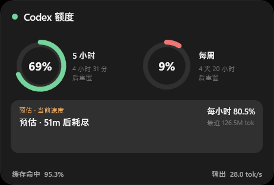
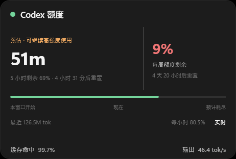
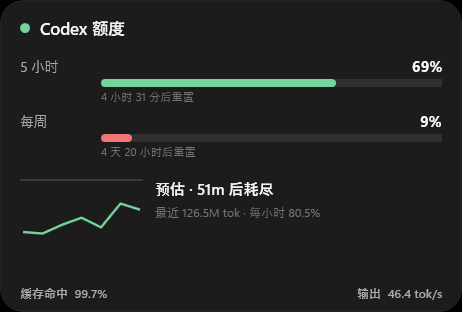
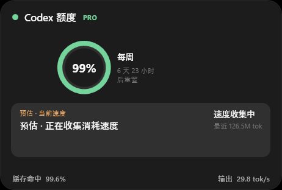
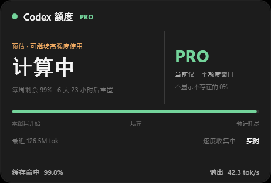

# Codex额度悬浮窗 Codex Quota Monitor

[](https://www.microsoft.com/windows)
[](https://dotnet.microsoft.com/)
[](https://github.com/FuFu-Flash/codex-quota-monitor/releases/latest)
[](LICENSE)

一个跟随 ChatGPT 启动的 Windows 原生悬浮窗，在屏幕右下角实时显示套餐实际返回的额度窗口、缓存命中率与模型输出速度。Plus 通常有 5 小时与每周额度；Pro 可能只返回每周额度。

不需要 API Key，不读取浏览器 Cookie。额度通过 Codex App Server 获取，token 遥测来自本机 Codex 会话记录。

## 界面

### ChatGPT Plus

Plus 通常返回 5 小时与每周两个额度窗口，因此 A / B / C 布局都会同时呈现短期和长期额度。

| A · 原生清单 | B · 双环仪表 | C · 预测 HUD |
| --- | --- | --- |
|  |  |  |

### ChatGPT Pro

Pro 当前只返回一个每周额度窗口。

| A · 原生清单 | B · 单环仪表 | C · 预测 HUD |
| --- | --- | --- |
|  |  |  |

鼠标移入悬浮窗后，可以直接切换 A / B / C 布局。窗口支持深色、浅色和跟随 Codex/系统主题。

## 功能

- 按套餐实际返回 5 小时/每周额度、重置倒计时与套餐标识
- 登录状态失效时自动重启 App Server 并刷新 ChatGPT 登录会话
- 缓存命中率：`cached input tokens / input tokens`
- 输出速度：最近一次模型响应的平均 `output tokens / second`
- 本地消耗速度与预计耗尽时间
- 当前 ChatGPT 账号头像作为托盘图标
- 低额度通知、手动刷新、显示/隐藏与多显示器位置记忆
- 随 Codex 会话启动，不会长期占用任务栏空间
- 三套可切换紧凑布局

> Codex 在响应检查点写入 token 使用记录，因此 `tok/s` 是最近一次已完成模型响应的端到端平均值，不是逐字符瞬时速度。没有可靠样本时显示 `—`。

## 安装

1. 从 [Releases](https://github.com/FuFu-Flash/codex-quota-monitor/releases/latest) 下载 `Setup.exe`。
2. 运行安装程序。
3. 打开或重新启动 ChatGPT 客户端。

系统要求：Windows 10/11 x64，并已登录支持 Codex 的 ChatGPT 账号。

当前安装包尚未使用商业代码签名证书签名。Windows SmartScreen 可能显示“未知发布者”；请从本仓库 Release 下载并核对 Release 中的 SHA-256。

## 工作方式与隐私

```text
ChatGPT
   ├─ App Server ────────> 套餐实际返回的额度窗口
   └─ 本机会话 JSONL ───> 缓存命中率 / 输出 tok/s
                              │
                              ▼
                     WPF 悬浮窗 + 托盘
```

- 所有统计均在本机完成。
- 不上传提示词、会话内容或账号数据。
- 会话文件只解析 token 数量和时间戳。
- 头像使用 Codex 账号资料中公开的头像 URL，并在本机缓存。

## 控制命令

安装插件后，可在 PowerShell 中运行：

```powershell
$plugin = "$HOME\plugins\codex-quota-monitor"
powershell.exe -NoProfile -ExecutionPolicy Bypass -File "$plugin\scripts\control.ps1" -Action status
```

支持的动作：`show`、`hide`、`toggle`、`refresh`、`status`、`variant-a`、`variant-b`、`variant-c`、`theme-auto`、`theme-light`、`theme-dark`、`exit`。

## 从源码构建

需要 .NET 8 SDK 和 Windows x64：

```powershell
powershell.exe -NoProfile -ExecutionPolicy Bypass -File .\scripts\build-release.ps1
```

生成文件：

- `artifacts/monitor/CodexQuotaMonitor.exe`
- `artifacts/release/Setup.exe`
- `artifacts/release/Setup.exe.sha256`

## 项目结构

```text
monitor-src/     WPF 悬浮窗
installer-src/   WinForms 安装程序
plugin/          Codex 插件清单、Hook、Skill 与控制脚本
scripts/         可复现构建脚本
docs/images/     README 界面截图
```

## 安全说明

如果发现安全问题，请不要创建公开 Issue；请使用 GitHub 的私密漏洞报告功能。

## License

[MIT](LICENSE)
